<p align="center">
  
</p>

<h1 align="center">INVICTUS - KRISHI MITRA</h1>

## 🌾 Overview

*Invictus - Krishi Mitra* is an innovative mobile application designed to empower farmers across India by leveraging advanced technologies. Developed during a hackathon, this app provides comprehensive agricultural support, enhancing productivity and sustainability.

## 🚀 Features

- 🤖 *Chatbot Assistance* – Farmers can ask queries related to farming and get instant AI-driven responses.
- 🌱 *Crop and Disease Detection* – Uses machine learning models to identify crop types and diagnose diseases from uploaded images, providing treatment recommendations.
- 📜 *Government Schemes Information* – Offers insights into various government initiatives available to farmers, ensuring easy access to benefits.
- 🌦 *Weather Forecasting* – Provides real-time weather updates and forecasts to help farmers plan effectively.
- 📈 *Market Price Updates* – Displays current market prices of crops, enabling informed selling decisions.
- 📋 *Complete Crop Plan Generation* – Generates an optimized crop plan based on soil quality, weather conditions, and market trends.
- 🌾 *Farmers Community* – A platform where farmers can interact, share knowledge, and support each other.

## Screenshots
  
  
  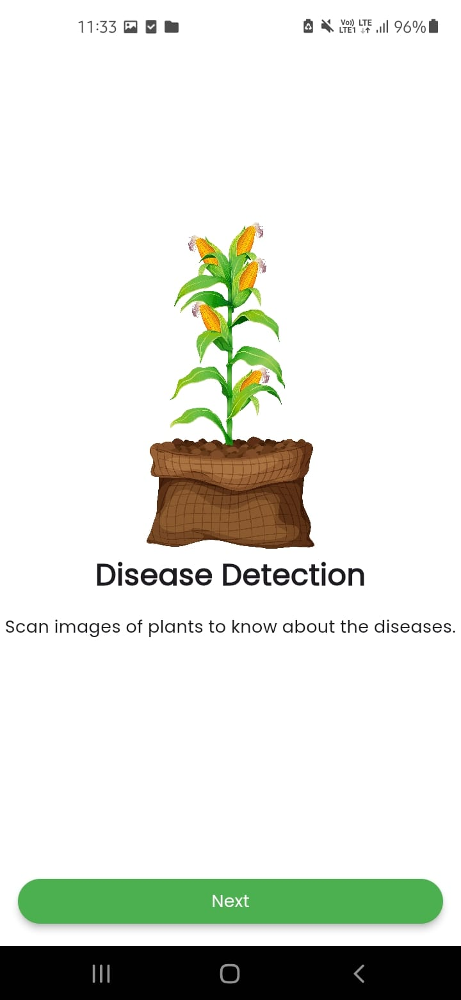
  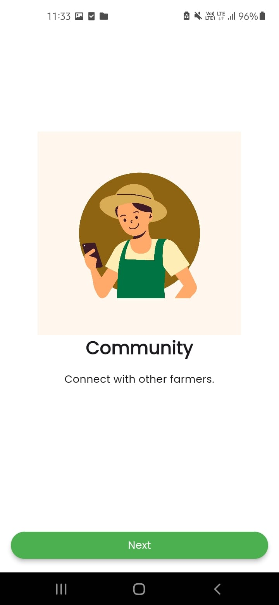
  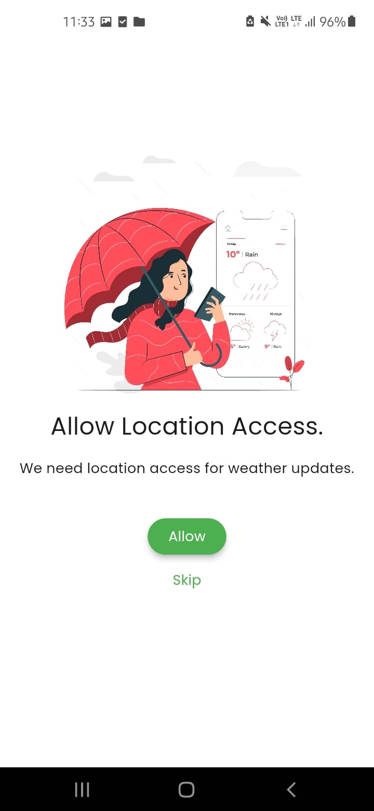
  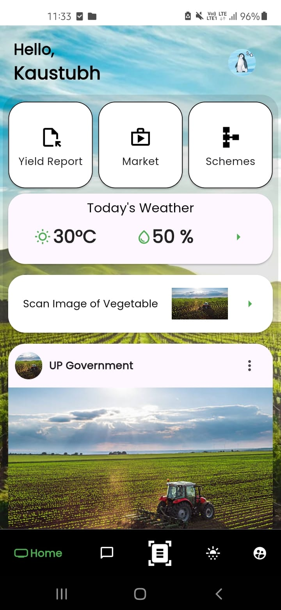
  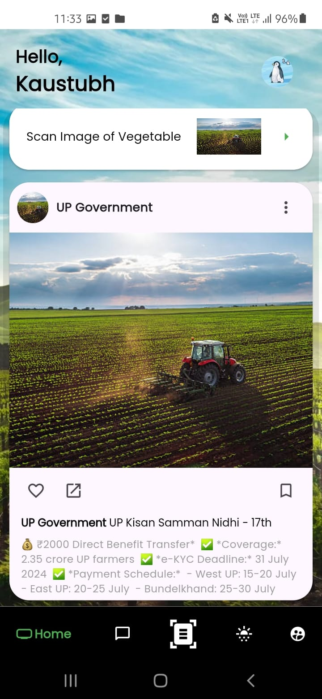
  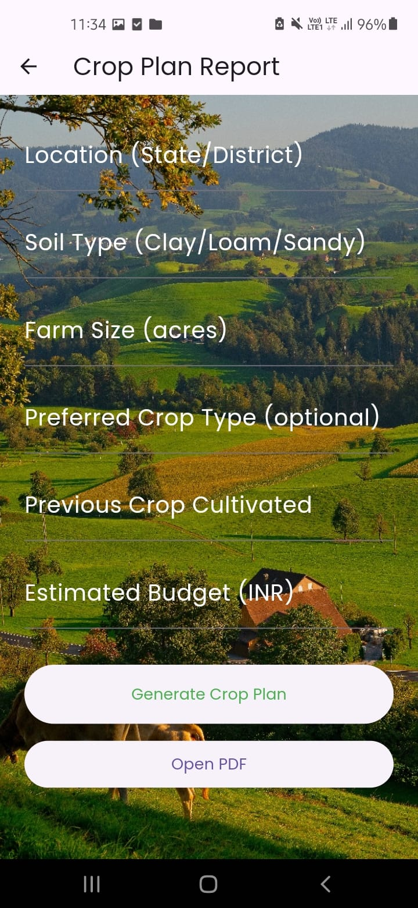
  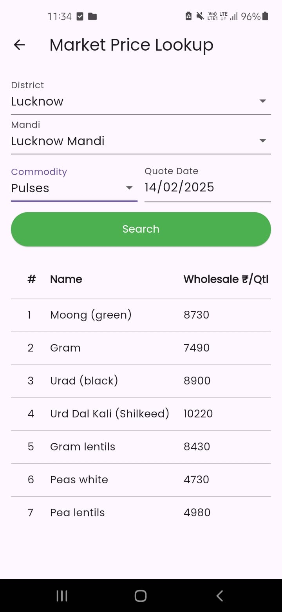
  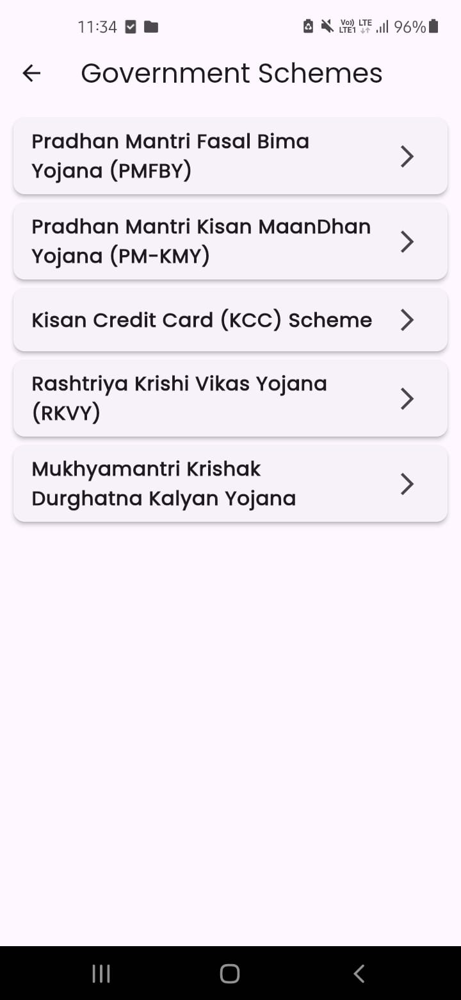
  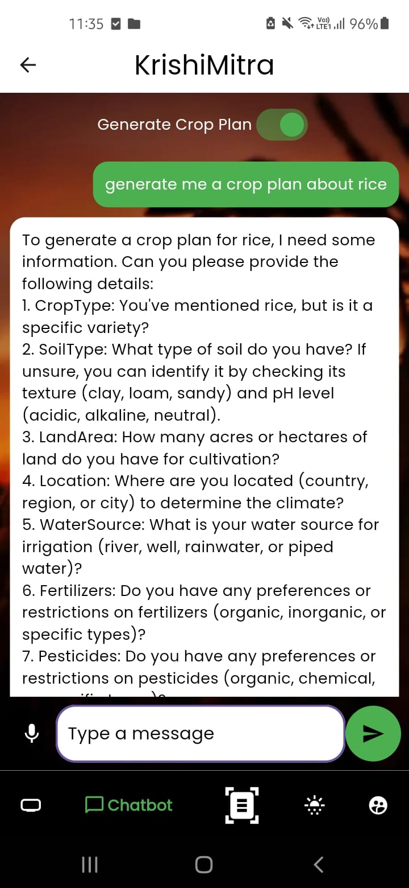
  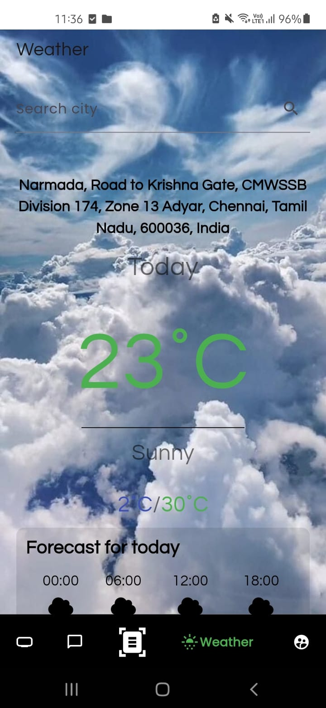
  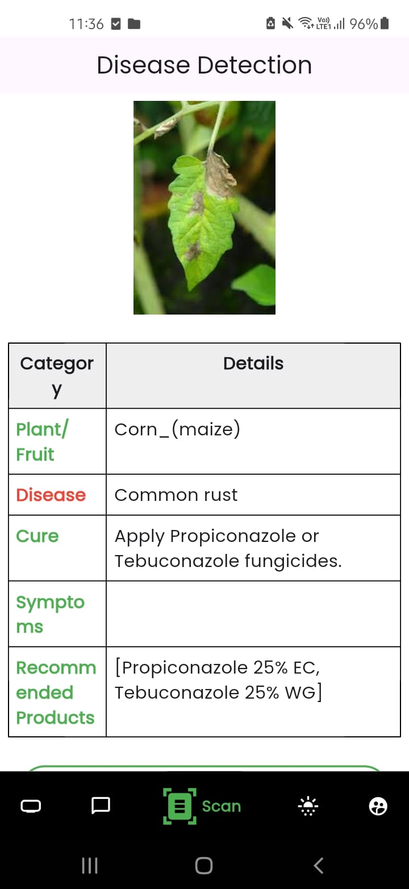
  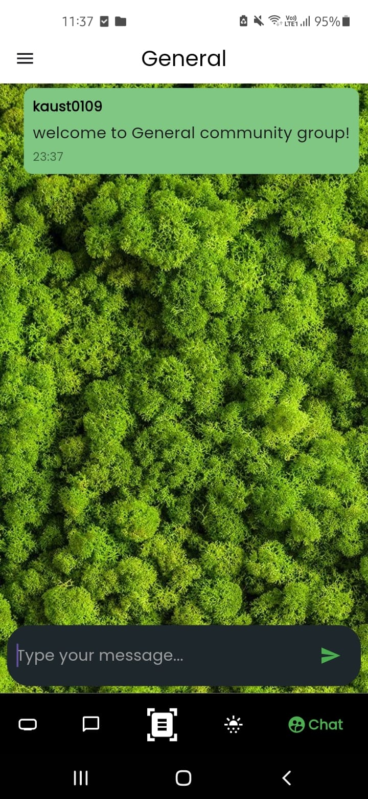
  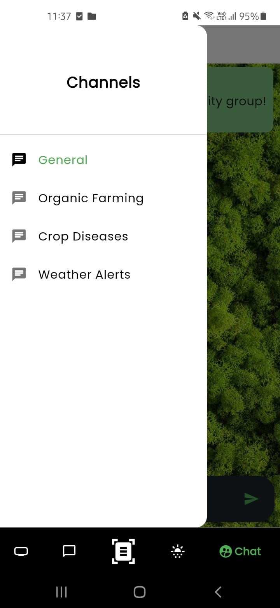
  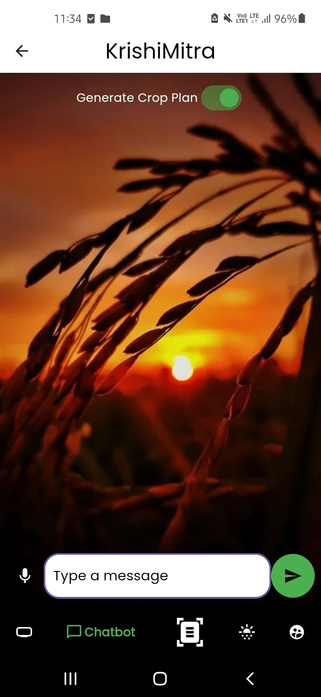

## 🛠 Tech Stack

- *Frontend*: Flutter (Dart)
- *Backend*: FastAPI (Python)
- *Database*: Firebase Firestore
- *Machine Learning Models*: Trained using TensorFlow and integrated via RESTful APIs

## 📂 Project Structure

```bash
invictus/
├── android/                # Android-specific code
├── assets/                 # Images, icons, and other assets
├── ios/                    # iOS-specific code
├── lib/                    # Main application code
│   ├── main.dart           # Entry point of the application
│   ├── pages/              # UI screens
├── test/                   # Unit and widget tests
backend/                # Backend API code
│   ├── main.py              # Entry point for FastAPI 
│   ├── models/             # Database models
│   ├── routes/             # API routes
├── pubspec.yaml            # Flutter project configuration
└── README.md               # Project documentation
```

## ⚡ Installation and Setup

### 1️⃣ Clone the repository
bash
git clone https://github.com/0kt1/invictus-repo
cd invictus


### 2️⃣ Set up the Backend
bash
cd backend
python3 -m venv venv
source env/bin/activate  # On Windows: .\venv\Scripts\activate
pip install -r requirements.txt
uvicorn app:app --reload  # Starts FastAPI server at http://127.0.0.1:8000


### 3️⃣ Set up the Frontend
```bash
cd invictus
flutter pub get
flutter run  # Run the app on a connected device or emulator
```

## 📌 Usage

- *Capture or Upload Images*: Analyze crops and detect diseases.
- *Get Diagnoses*: View disease reports and treatment suggestions.
- *Access Government Schemes*: Explore relevant schemes for farmers.
- *Stay Updated*: Receive real-time weather and market price alerts.

## 👥 Team Members

- *Anmol Upadhyay*
- *Ayushman Pal*
- *Kaustubh Titare*
- *Devesh Negi*
- *Rishika Singh*

## 🤝 Contributing

1. *Fork the repository*.
2. *Create a new branch*:
   bash
   git checkout -b feature/your_feature_name
   
3. *Make your changes*.
4. *Commit your changes*:
   bash
   git commit -m "Add your commit message here"
   
5. *Push to your branch*:
   bash
   git push origin feature/your_feature_name
   
6. *Create a pull request*.

## 📜 License

This project is licensed under the MIT License. See the [LICENSE](LICENSE) file for more details.

## 🙌 Acknowledgements

- *Hackathon Organizers*: For providing a platform to build this innovation.
- *Contributors*: Everyone involved in development and testing.
- *Users*: The farming community for their invaluable feedback and support.

---

*Let's revolutionize agriculture with technology! 🌍🚜*